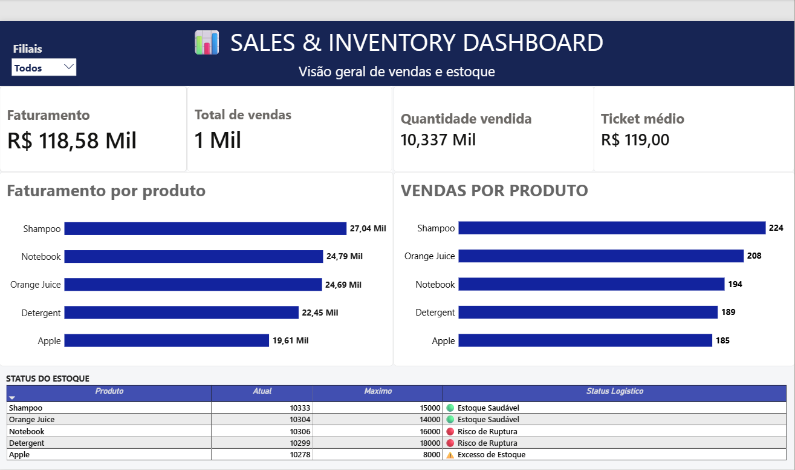

# 📊 Supply Chain & Inventory Analytics Dashboard

## 🎯 Objetivo do Projeto
Dashboard executivo desenvolvido para monitoramento em tempo real de KPIs de vendas e gestão estratégica de inventário na cadeia de suprimentos, com foco em prevenção de rupturas (Stockout) e excessos de estoque (Overstock).

---

## 🛠️ Tecnologias e Ferramentas Utilizadas
* **Microsoft Excel:** Tratamento, higienização e estruturação das regras de negócio de inventário.
* **Power BI:** Modelagem de dados relacional, criação de medidas em DAX e desenvolvimento do layout executivo.
* **Git & GitHub:** Versionamento de código e documentação técnica.

---

## 💡 Métricas & Inteligência Logística
* **KPIs Globais:** Faturamento Total, Volume de Vendas, Quantidade de Itens Vendidos e Ticket Médio por transação.
* **Desempenho por Produto:** Análise comparativa de saída por categoria e volume financeiro.
* **Status Logístico Automático:**
  * 🔴 **Risco de Ruptura:** Estoque Atual < Estoque de Segurança
  * ⚠️ **Excesso de Estoque:** Estoque Atual > Estoque Máximo
  * 🟢 **Estoque Saudável:** Nível dentro da margem operacional ideal

---

## 📸 Visualização do Dashboard

